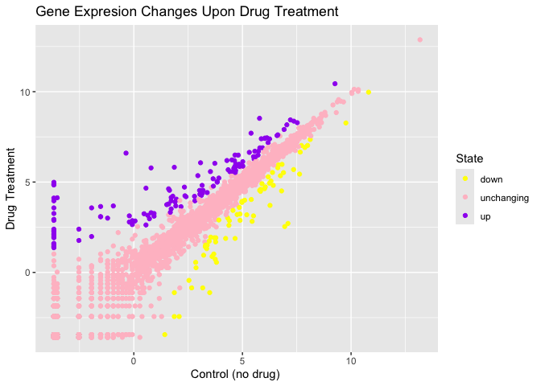
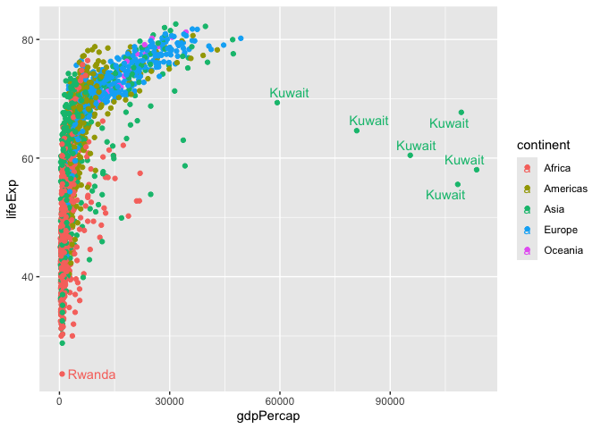

# Class 5: Data Viz with ggplot
Blinda (PID: A17117043)

Today we are exploring the **gggplot** package and how to make nice
figures in R.

There are lots of ways to make figures and plot in R. These include:

- so called “base”R
- and add on packages like **ggplot2**

Here is a simple “base” R plot

``` r
head(cars)
```

      speed dist
    1     4    2
    2     4   10
    3     7    4
    4     7   22
    5     8   16
    6     9   10

We can simply pass this to the ‘plot()’ function

``` r
plot(cars)
```


> Key-point: Base R is quick but not so nice looking in some folks eyes.

let’s see how we can plot this with **ggplot2**

1st I need to install this add-on package. For this we use the
‘install.packages()’ function - **WE DO THIS IN THE CONSOLE, NOT our
report**

2nd We need to load the package with the ‘library()’ function every time
we want to use it.

``` r
library(ggplot2)
ggplot(cars)
```


Every ggplot is complosed of at least 3 laryers:

- **data** (i.e. a data.frame with the things you wnat to plot)
- aesthetics **aes()** that map the columns of data to your plot
  features (i.e. aesthetics)
- geoms like **gemo_plot()** that sort hwo the plot appears

``` r
ggplot(cars) + 
  aes(x=speed, y=dist) + 
  geom_point()
```


``` r
hist(cars$speed)
```


> Key point: For simple “canned” graphs base R is quicker and more
> concise but as things get more custom the elobrate then ggplot wins
> out…

Let’s add more layers to our ggplot

Add a line showing the relationship between x and y Add a title Add
custom axis labels “Speed (MPH)” and “Distance (ft)” Change the theme…

``` r
ggplot(cars) +
  aes(x=speed, y=dist) +
  geom_point() +
  geom_smooth(method="lm",se=FALSE) +
  labs(title="Silly plot of Speed vs Stoping distance",
       x="speed (MPH)",
       y="distance (ft)" ) +
  theme_bw()
```

    `geom_smooth()` using formula = 'y ~ x'


\##Going further

Read some gene expression data

``` r
url <- "https://bioboot.github.io/bimm143_S20/class-material/up_down_expression.txt"
genes <- read.delim(url)

head(genes)
```

            Gene Condition1 Condition2      State
    1      A4GNT -3.6808610 -3.4401355 unchanging
    2       AAAS  4.5479580  4.3864126 unchanging
    3      AASDH  3.7190695  3.4787276 unchanging
    4       AATF  5.0784720  5.0151916 unchanging
    5       AATK  0.4711421  0.5598642 unchanging
    6 AB015752.4 -3.6808610 -3.5921390 unchanging

> Q1. How many gnees are in this wee dataset

``` r
nrow(genes)
```

    [1] 5196

``` r
ncol(genes)
```

    [1] 4

> Q2. How many “up” regulated genes are there?

``` r
sum(genes$State == "up")
```

    [1] 127

A useful function for counting up occurances of things in a vector is
the ‘table()’ function

``` r
table(genes$State)
```


          down unchanging         up 
            72       4997        127 

fraction

``` r
round( table(genes$State)/nrow(genes) * 100, 2 )
```


          down unchanging         up 
          1.39      96.17       2.44 

Make a v1 figure

``` r
p <-ggplot(genes) +
  aes(x=Condition1, 
      y=Condition2, 
      col=State) +
  geom_point()

p
```


``` r
p + scale_colour_manual(values=c("yellow","pink","purple")) +
    labs(title="Gene Expresion Changes Upon Drug Treatment",
         x="Control (no drug) ",
         y="Drug Treatment")
```



## More Plotting

Read gapmider

``` r
# File location online
url <- "https://raw.githubusercontent.com/jennybc/gapminder/master/inst/extdata/gapminder.tsv"

gapminder <- read.delim(url)
```

Lets have a wee peak

``` r
head(gapminder,3)
```

          country continent year lifeExp      pop gdpPercap
    1 Afghanistan      Asia 1952  28.801  8425333  779.4453
    2 Afghanistan      Asia 1957  30.332  9240934  820.8530
    3 Afghanistan      Asia 1962  31.997 10267083  853.1007

> Q4. How many different country values are in this dataset?

``` r
nrow(gapminder)
```

    [1] 1704

``` r
table(gapminder$country)
```


                 Afghanistan                  Albania                  Algeria 
                          12                       12                       12 
                      Angola                Argentina                Australia 
                          12                       12                       12 
                     Austria                  Bahrain               Bangladesh 
                          12                       12                       12 
                     Belgium                    Benin                  Bolivia 
                          12                       12                       12 
      Bosnia and Herzegovina                 Botswana                   Brazil 
                          12                       12                       12 
                    Bulgaria             Burkina Faso                  Burundi 
                          12                       12                       12 
                    Cambodia                 Cameroon                   Canada 
                          12                       12                       12 
    Central African Republic                     Chad                    Chile 
                          12                       12                       12 
                       China                 Colombia                  Comoros 
                          12                       12                       12 
            Congo, Dem. Rep.              Congo, Rep.               Costa Rica 
                          12                       12                       12 
               Cote d'Ivoire                  Croatia                     Cuba 
                          12                       12                       12 
              Czech Republic                  Denmark                 Djibouti 
                          12                       12                       12 
          Dominican Republic                  Ecuador                    Egypt 
                          12                       12                       12 
                 El Salvador        Equatorial Guinea                  Eritrea 
                          12                       12                       12 
                    Ethiopia                  Finland                   France 
                          12                       12                       12 
                       Gabon                   Gambia                  Germany 
                          12                       12                       12 
                       Ghana                   Greece                Guatemala 
                          12                       12                       12 
                      Guinea            Guinea-Bissau                    Haiti 
                          12                       12                       12 
                    Honduras         Hong Kong, China                  Hungary 
                          12                       12                       12 
                     Iceland                    India                Indonesia 
                          12                       12                       12 
                        Iran                     Iraq                  Ireland 
                          12                       12                       12 
                      Israel                    Italy                  Jamaica 
                          12                       12                       12 
                       Japan                   Jordan                    Kenya 
                          12                       12                       12 
            Korea, Dem. Rep.              Korea, Rep.                   Kuwait 
                          12                       12                       12 
                     Lebanon                  Lesotho                  Liberia 
                          12                       12                       12 
                       Libya               Madagascar                   Malawi 
                          12                       12                       12 
                    Malaysia                     Mali               Mauritania 
                          12                       12                       12 
                   Mauritius                   Mexico                 Mongolia 
                          12                       12                       12 
                  Montenegro                  Morocco               Mozambique 
                          12                       12                       12 
                     Myanmar                  Namibia                    Nepal 
                          12                       12                       12 
                 Netherlands              New Zealand                Nicaragua 
                          12                       12                       12 
                       Niger                  Nigeria                   Norway 
                          12                       12                       12 
                        Oman                 Pakistan                   Panama 
                          12                       12                       12 
                    Paraguay                     Peru              Philippines 
                          12                       12                       12 
                      Poland                 Portugal              Puerto Rico 
                          12                       12                       12 
                     Reunion                  Romania                   Rwanda 
                          12                       12                       12 
       Sao Tome and Principe             Saudi Arabia                  Senegal 
                          12                       12                       12 
                      Serbia             Sierra Leone                Singapore 
                          12                       12                       12 
             Slovak Republic                 Slovenia                  Somalia 
                          12                       12                       12 
                South Africa                    Spain                Sri Lanka 
                          12                       12                       12 
                       Sudan                Swaziland                   Sweden 
                          12                       12                       12 
                 Switzerland                    Syria                   Taiwan 
                          12                       12                       12 
                    Tanzania                 Thailand                     Togo 
                          12                       12                       12 
         Trinidad and Tobago                  Tunisia                   Turkey 
                          12                       12                       12 
                      Uganda           United Kingdom            United States 
                          12                       12                       12 
                     Uruguay                Venezuela                  Vietnam 
                          12                       12                       12 
          West Bank and Gaza              Yemen, Rep.                   Zambia 
                          12                       12                       12 
                    Zimbabwe 
                          12 

``` r
length(table(gapminder$country))
```

    [1] 142

> Q5.How many different continent values are in this dataset.

``` r
unique(gapminder$continent)
```

    [1] "Asia"     "Europe"   "Africa"   "Americas" "Oceania" 

``` r
ggplot(gapminder) +
  aes(gdpPercap, lifeExp, col=continent, label=country) +
  geom_point() +
  geom_text()
```


I can use **ggrepl** package to make more sensible labels here.

``` r
library(ggrepel)

ggplot(gapminder) +
  aes(gdpPercap, lifeExp, col=continent, label=country) +
  geom_point() +
  geom_text_repel()
```

    Warning: ggrepel: 1697 unlabeled data points (too many overlaps). Consider
    increasing max.overlaps



I want a seperate a pnnel per continent

``` r
ggplot(gapminder) +
  aes(gdpPercap, lifeExp, col=continent, label=country) +
  geom_point() +
  facet_wrap(~continent)
```


\##Summary

The main advantages of ggplot over base R plotting are:

Let’s focus on the main advantages of ggplot2 over base R plotting:

1.  ggplot2 uses a layered approach (data, aesthetics, geometry), making
    it easier to build complex, publication-quality plots by adding
    layers step by step. Base R requires different functions and many
    arguments for each plot type, which can be fiddly and time-consuming
    to refine for publication-quality figures.

2.  ggplot2 provides sensible defaults for aesthetics and themes, so
    plots look visually appealing with less manual tweaking. Base R
    gives full control but often needs more effort to polish.

3.  ggplot2 code is more concise for complex plots, while base R is
    quicker for simple, exploratory plots but gets verbose and
    complicated for advanced visualizations.

4.  ggplot2 makes it easier to automate and reproduce plots, especially
    for reports, since the same code structure applies to different
    datasets and plot types.
