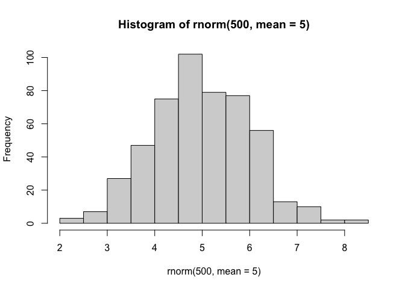
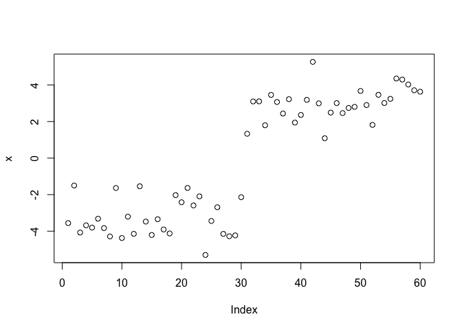
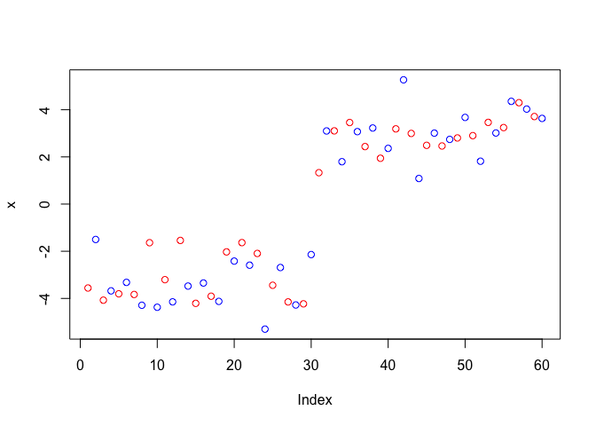
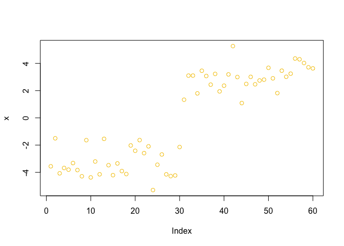
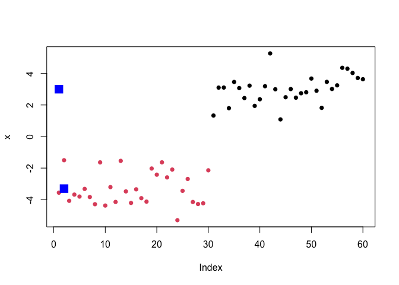
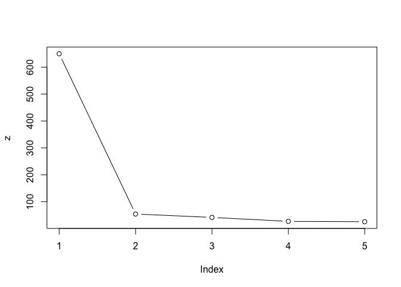
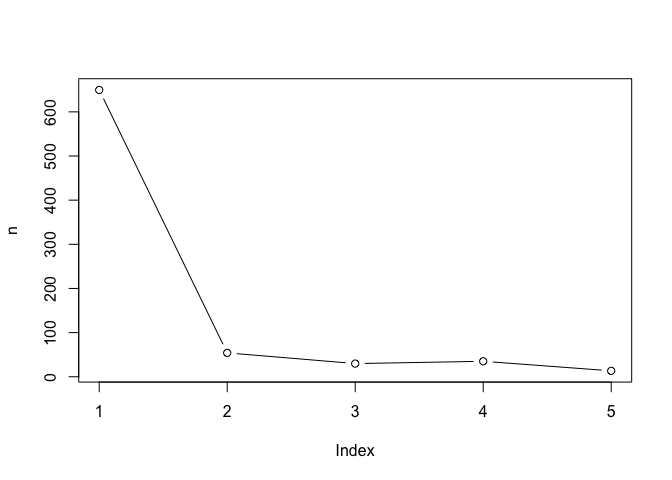
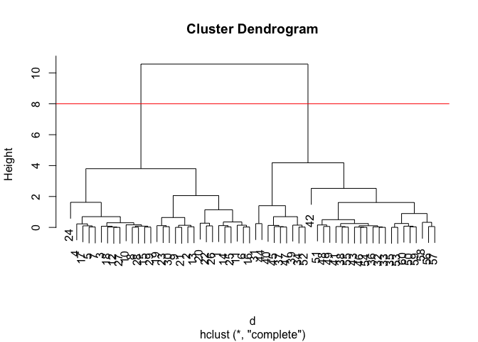
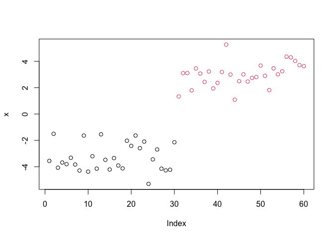

# Lab 07 Machine Learning 1
Blinda Sui (PID: A17117043)

Today we will explore some fundamental machine learning methods
including clustering and dimensionality reduction.

## K-means clustering

To see how this works let’s first makeup some data to cluster where we
know what the answer should be. We can use the `rnorm()` function to
help here:

``` r
hist(rnorm(500, mean=5))
```



``` r
x <- c(rnorm(30, mean=-3),rnorm(30, mean=3)) 
y <- rev(x) #reverse x
```

``` r
cbind(x, y)
```

                  x         y
     [1,] -3.558170  3.632061
     [2,] -1.501385  3.710897
     [3,] -4.074267  4.027479
     [4,] -3.679126  4.299014
     [5,] -3.804401  4.355379
     [6,] -3.319883  3.243559
     [7,] -3.832704  3.013477
     [8,] -4.289685  3.463544
     [9,] -1.637985  1.816822
    [10,] -4.374156  2.901404
    [11,] -3.204849  3.673818
    [12,] -4.145656  2.803598
    [13,] -1.541535  2.742934
    [14,] -3.476352  2.463249
    [15,] -4.208345  3.008345
    [16,] -3.346022  2.490190
    [17,] -3.906891  1.085147
    [18,] -4.125254  2.995049
    [19,] -2.027630  5.267389
    [20,] -2.417331  3.188682
    [21,] -1.634382  2.361781
    [22,] -2.590232  1.942936
    [23,] -2.093131  3.225211
    [24,] -5.301714  2.437554
    [25,] -3.442146  3.071399
    [26,] -2.689639  3.458139
    [27,] -4.147775  1.796105
    [28,] -4.277262  3.103786
    [29,] -4.229445  3.100339
    [30,] -2.141675  1.330859
    [31,]  1.330859 -2.141675
    [32,]  3.100339 -4.229445
    [33,]  3.103786 -4.277262
    [34,]  1.796105 -4.147775
    [35,]  3.458139 -2.689639
    [36,]  3.071399 -3.442146
    [37,]  2.437554 -5.301714
    [38,]  3.225211 -2.093131
    [39,]  1.942936 -2.590232
    [40,]  2.361781 -1.634382
    [41,]  3.188682 -2.417331
    [42,]  5.267389 -2.027630
    [43,]  2.995049 -4.125254
    [44,]  1.085147 -3.906891
    [45,]  2.490190 -3.346022
    [46,]  3.008345 -4.208345
    [47,]  2.463249 -3.476352
    [48,]  2.742934 -1.541535
    [49,]  2.803598 -4.145656
    [50,]  3.673818 -3.204849
    [51,]  2.901404 -4.374156
    [52,]  1.816822 -1.637985
    [53,]  3.463544 -4.289685
    [54,]  3.013477 -3.832704
    [55,]  3.243559 -3.319883
    [56,]  4.355379 -3.804401
    [57,]  4.299014 -3.679126
    [58,]  4.027479 -4.074267
    [59,]  3.710897 -1.501385
    [60,]  3.632061 -3.558170

``` r
plot(x)
```



The function for K-means clustering in “base” R is `kmeans()`

``` r
kmeans(x, centers = 2)
```

    K-means clustering with 2 clusters of sizes 30, 30

    Cluster means:
           [,1]
    1  3.000338
    2 -3.300634

    Clustering vector:
     [1] 2 2 2 2 2 2 2 2 2 2 2 2 2 2 2 2 2 2 2 2 2 2 2 2 2 2 2 2 2 2 1 1 1 1 1 1 1 1
    [39] 1 1 1 1 1 1 1 1 1 1 1 1 1 1 1 1 1 1 1 1 1 1

    Within cluster sum of squares by cluster:
    [1] 23.48218 30.61468
     (between_SS / total_SS =  91.7 %)

    Available components:

    [1] "cluster"      "centers"      "totss"        "withinss"     "tot.withinss"
    [6] "betweenss"    "size"         "iter"         "ifault"      

``` r
k <- kmeans(x, centers = 2)
k
```

    K-means clustering with 2 clusters of sizes 30, 30

    Cluster means:
           [,1]
    1  3.000338
    2 -3.300634

    Clustering vector:
     [1] 2 2 2 2 2 2 2 2 2 2 2 2 2 2 2 2 2 2 2 2 2 2 2 2 2 2 2 2 2 2 1 1 1 1 1 1 1 1
    [39] 1 1 1 1 1 1 1 1 1 1 1 1 1 1 1 1 1 1 1 1 1 1

    Within cluster sum of squares by cluster:
    [1] 23.48218 30.61468
     (between_SS / total_SS =  91.7 %)

    Available components:

    [1] "cluster"      "centers"      "totss"        "withinss"     "tot.withinss"
    [6] "betweenss"    "size"         "iter"         "ifault"      

\#:) Clustering vector: the first 30 belongs to cluster 1 and last 30
belongs to cluster 2 \#:) Within cluster sume of squares by cluster
(WCSS): For k=2 clusters, these are the WCSS values for cluster 1 and
cluster 2. Lower = tighter cluster. Here, cluster 2 is looser (30.12 \>
16.66). \#:) (between_SS / total_SS = 92.4%): the proportion of total
variance “explained” by the separation between the two cluster centroids
= only 7.6% of the variance remains within clusters.

To get the results of the returned list object we can use the dollar `$`
syntax.

> Q. How many points are in each cluster?

``` r
k$size
```

    [1] 30 30

> Q. What ‘component’ of your result object details - cluster
> assignment/membership? - cluster center?

``` r
k$cluster
```

     [1] 2 2 2 2 2 2 2 2 2 2 2 2 2 2 2 2 2 2 2 2 2 2 2 2 2 2 2 2 2 2 1 1 1 1 1 1 1 1
    [39] 1 1 1 1 1 1 1 1 1 1 1 1 1 1 1 1 1 1 1 1 1 1

``` r
k$centers
```

           [,1]
    1  3.000338
    2 -3.300634

> Q. Make a clustering results figure of the data colored by cluster
> membership and show cluster centers.

``` r
plot(x, col = c("red", "blue"))
```



``` r
plot(x, col = 7)
```



``` r
plot(x, col = k$cluster, pch=16)
points(k$centers, col="blue", pch=15, cex=2)
```



K-means clustering is very popular as it is very fast and relatively
straight forward: it takes numeric data as input and returns the
clusterm membership vector etc.

The “issue” is we tell `kmeans()` how many clusters we want!

> Q. Run kmeans again and cluster into 4 frps/clusters and plot the
> results like we did above?

``` r
k4 <- kmeans(x, centers = 4)
plot(x, col=k4$cluster)
points(k4$centers, pch=15)
```


Scree plot to pick k `center` value

brute-force

``` r
k1 <- kmeans(x, centers = 1)
k2 <- kmeans(x, centers = 2)
k3 <- kmeans(x, centers = 3)
k4 <- kmeans(x, centers = 4)
k5 <- kmeans(x, centers = 5)
```

``` r
z <- c(k1$tot.withinss, 
       k2$tot.withinss,
       k3$tot.withinss,
       k4$tot.withinss,
       k5$tot.withinss)

plot(z, typ = "b")
```



``` r
n <- NULL
for(i in 1:5) {
  n <- c(n, kmeans(x, centers = i)$tot.withinss)
}

plot(n, typ = "b")
```



## Hierarchical CLustering

The main “base” R function for Hierarchical Clustering is called
`cluster()`. Here we can’t just input our data, we need to first
calculate a distance matrix (e.g.`dist()`) for our data and use this as
input to `hclust()`

``` r
d <- dist(x)
hc <- hclust(d)
hc
```


    Call:
    hclust(d = d)

    Cluster method   : complete 
    Distance         : euclidean 
    Number of objects: 60 

There is a plot method for hclust results, lets try it

``` r
plot(hc)
abline(h=8, col="red") #abline(): to add straight lines to an existing plot.
```



To get our cluster “membership” vector (i.e. our main clustering result)
we can “cut” the tree at a given height or at height that yields a given
“k” gorups.

``` r
cutree(hc, h=8)
```

     [1] 1 1 1 1 1 1 1 1 1 1 1 1 1 1 1 1 1 1 1 1 1 1 1 1 1 1 1 1 1 1 2 2 2 2 2 2 2 2
    [39] 2 2 2 2 2 2 2 2 2 2 2 2 2 2 2 2 2 2 2 2 2 2

``` r
grps <- cutree(hc, k=2)
```

> Q. Plot the data with our hclust result coloring

``` r
plot(x, col=grps)
```



# Principal Component Analysis (PCA)

## PCA of UK food data

Import food data from an online CSV file:

``` r
url <- "https://tinyurl.com/UK-foods"
x <- read.csv(url)
head(x)
```

                   X England Wales Scotland N.Ireland
    1         Cheese     105   103      103        66
    2  Carcass_meat      245   227      242       267
    3    Other_meat      685   803      750       586
    4           Fish     147   160      122        93
    5 Fats_and_oils      193   235      184       209
    6         Sugars     156   175      147       139

``` r
rownames(x) <- x[, 1]
x <- x[, -1]
x
```

                        England Wales Scotland N.Ireland
    Cheese                  105   103      103        66
    Carcass_meat            245   227      242       267
    Other_meat              685   803      750       586
    Fish                    147   160      122        93
    Fats_and_oils           193   235      184       209
    Sugars                  156   175      147       139
    Fresh_potatoes          720   874      566      1033
    Fresh_Veg               253   265      171       143
    Other_Veg               488   570      418       355
    Processed_potatoes      198   203      220       187
    Processed_Veg           360   365      337       334
    Fresh_fruit            1102  1137      957       674
    Cereals                1472  1582     1462      1494
    Beverages                57    73       53        47
    Soft_drinks            1374  1256     1572      1506
    Alcoholic_drinks        375   475      458       135
    Confectionery            54    64       62        41

``` r
x <- read.csv(url, row.names = 1)
x
```

                        England Wales Scotland N.Ireland
    Cheese                  105   103      103        66
    Carcass_meat            245   227      242       267
    Other_meat              685   803      750       586
    Fish                    147   160      122        93
    Fats_and_oils           193   235      184       209
    Sugars                  156   175      147       139
    Fresh_potatoes          720   874      566      1033
    Fresh_Veg               253   265      171       143
    Other_Veg               488   570      418       355
    Processed_potatoes      198   203      220       187
    Processed_Veg           360   365      337       334
    Fresh_fruit            1102  1137      957       674
    Cereals                1472  1582     1462      1494
    Beverages                57    73       53        47
    Soft_drinks            1374  1256     1572      1506
    Alcoholic_drinks        375   475      458       135
    Confectionery            54    64       62        41

some base figures

``` r
barplot(as.matrix(x), beside=T, col=rainbow(nrow(x)))
```


``` r
barplot(as.matrix(x), beside=F, col=rainbow(nrow(x)))
```


There is one plot that can be useful for small datasets:

``` r
pairs(x, col=rainbow(nrow(x)), pch=16)
```


> Main point: It can be difficult to spot major trends and patterns even
> in relatively small multivariate datasets (here we only have 17
> dimensions, typically we have 1000s).

## PCA to the rescue

The main function in “base” R for PCA is called `prcomp()`

I will take the transpose of our data so the “food” are in the columns:

``` r
pca <- prcomp(t(x))
summary(pca)
```

    Importance of components:
                                PC1      PC2      PC3       PC4
    Standard deviation     324.1502 212.7478 73.87622 2.921e-14
    Proportion of Variance   0.6744   0.2905  0.03503 0.000e+00
    Cumulative Proportion    0.6744   0.9650  1.00000 1.000e+00

``` r
cols <- c("orange", "red", "blue", "darkgreen")
plot(pca$x[,1], pca$x[,2], col=cols, pch=16)
```


``` r
library(ggplot2)
```

``` r
ggplot(pca$x) +
  aes(PC1, PC2) +
  geom_point(col=cols)
```


``` r
ggplot(pca$rotation) +
  aes(PC1, rownames(pca$rotation)) +
  geom_col()
```


PCA looks super useful and we will come back to describe this further
next day ;-)
