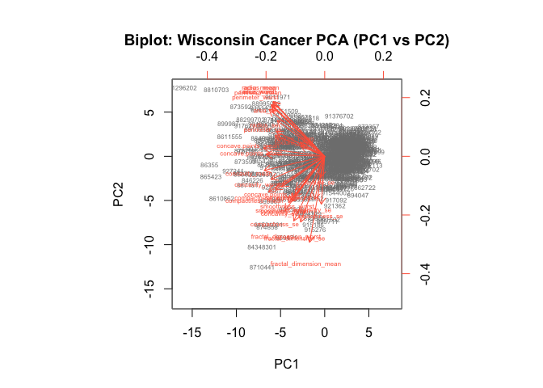
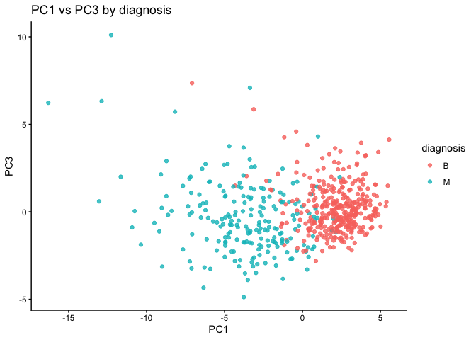

# Lab 08 Breast Cancer Analysis Mini Project
Blinda Sui (PID: A17117043)

- [Background](#background)
- [Data import](#data-import)
- [Data Exploration](#data-exploration)
- [Principal Component Analysis
  (PCA)](#principal-component-analysis-pca)
  - [PCA Score Plot](#pca-score-plot)
- [PCA Scree-plot](#pca-scree-plot)
  - [Communicating PCA results](#communicating-pca-results)
- [hierarchical clustering](#hierarchical-clustering)
- [Combining methods (PCA and
  CLustering)](#combining-methods-pca-and-clustering)
  - [K-means clustering](#k-means-clustering)
- [5. Combining Methods](#5-combining-methods)
- [6. Sensitivity/Specificity](#6-sensitivityspecificity)
- [7. Prediction](#7-prediction)

## Background

The goal of this mini-project is for you to explore a complete analysis
using the unsupervised learning techniques covered in class. You’ll
extend what you’ve learned by combining PCA as a preprocessing step to
clustering using data that consist of measurements of cell nuclei of
human breast masses. This expands on our RNA-Seq analysis from last day.

The data itself comes from the Wisconsin Breast Cancer Diagnostic Data
Set first reported by K. P. Benne and O. L. Mangasarian: “Robust Linear
Programming Discrimination of Two Linearly Inseparable Sets”.

Values in this data set describe characteristics of the cell nuclei
present in digitized images of a fine needle aspiration (FNA) of a
breast mass.

## Data import

Data was downloaded from the class website as a CSV file.

``` r
wisc.df <- read.csv("WisconsinCancer.csv", row.names=1)
head(wisc.df)
```

             diagnosis radius_mean texture_mean perimeter_mean area_mean
    842302           M       17.99        10.38         122.80    1001.0
    842517           M       20.57        17.77         132.90    1326.0
    84300903         M       19.69        21.25         130.00    1203.0
    84348301         M       11.42        20.38          77.58     386.1
    84358402         M       20.29        14.34         135.10    1297.0
    843786           M       12.45        15.70          82.57     477.1
             smoothness_mean compactness_mean concavity_mean concave.points_mean
    842302           0.11840          0.27760         0.3001             0.14710
    842517           0.08474          0.07864         0.0869             0.07017
    84300903         0.10960          0.15990         0.1974             0.12790
    84348301         0.14250          0.28390         0.2414             0.10520
    84358402         0.10030          0.13280         0.1980             0.10430
    843786           0.12780          0.17000         0.1578             0.08089
             symmetry_mean fractal_dimension_mean radius_se texture_se perimeter_se
    842302          0.2419                0.07871    1.0950     0.9053        8.589
    842517          0.1812                0.05667    0.5435     0.7339        3.398
    84300903        0.2069                0.05999    0.7456     0.7869        4.585
    84348301        0.2597                0.09744    0.4956     1.1560        3.445
    84358402        0.1809                0.05883    0.7572     0.7813        5.438
    843786          0.2087                0.07613    0.3345     0.8902        2.217
             area_se smoothness_se compactness_se concavity_se concave.points_se
    842302    153.40      0.006399        0.04904      0.05373           0.01587
    842517     74.08      0.005225        0.01308      0.01860           0.01340
    84300903   94.03      0.006150        0.04006      0.03832           0.02058
    84348301   27.23      0.009110        0.07458      0.05661           0.01867
    84358402   94.44      0.011490        0.02461      0.05688           0.01885
    843786     27.19      0.007510        0.03345      0.03672           0.01137
             symmetry_se fractal_dimension_se radius_worst texture_worst
    842302       0.03003             0.006193        25.38         17.33
    842517       0.01389             0.003532        24.99         23.41
    84300903     0.02250             0.004571        23.57         25.53
    84348301     0.05963             0.009208        14.91         26.50
    84358402     0.01756             0.005115        22.54         16.67
    843786       0.02165             0.005082        15.47         23.75
             perimeter_worst area_worst smoothness_worst compactness_worst
    842302            184.60     2019.0           0.1622            0.6656
    842517            158.80     1956.0           0.1238            0.1866
    84300903          152.50     1709.0           0.1444            0.4245
    84348301           98.87      567.7           0.2098            0.8663
    84358402          152.20     1575.0           0.1374            0.2050
    843786            103.40      741.6           0.1791            0.5249
             concavity_worst concave.points_worst symmetry_worst
    842302            0.7119               0.2654         0.4601
    842517            0.2416               0.1860         0.2750
    84300903          0.4504               0.2430         0.3613
    84348301          0.6869               0.2575         0.6638
    84358402          0.4000               0.1625         0.2364
    843786            0.5355               0.1741         0.3985
             fractal_dimension_worst
    842302                   0.11890
    842517                   0.08902
    84300903                 0.08758
    84348301                 0.17300
    84358402                 0.07678
    843786                   0.12440

## Data Exploration

The first column `diagnosis` is the expert opinion on the sample
(i.e. patient FNA).

``` r
head(wisc.df$diagnosis)
```

    [1] "M" "M" "M" "M" "M" "M"

Remove the diagnosis from data for subsequent analysis

``` r
#remove the first (diagnosis) column
wisc.data <- wisc.df[,-1] 
#[ ]: subsetting R objects, including data frames, vectors, and matrices. 
#,: [rows, columns]
#-1: exclude the first column/row

dim(wisc.data) 
```

    [1] 569  30

``` r
#dim(): get the dimensions of the wisc.data object - returns a vector with two numbers: # of rows and # of columns
```

Store the diagnosis as a vector for use later when we compare our
results to those from experts in the field.

``` r
diagnosis <- factor(wisc.df$diagnosis)
```

> Q1.How many observations are in this dataset?

There are 569 observations/patients in the dataset

``` r
nrow(wisc.data)
```

    [1] 569

> Q2. How many of the observations have a malignant diagnosis?

``` r
table(wisc.df$diagnosis)
```


      B   M 
    357 212 

``` r
#table(): output a table displaying the counts of each unique value present in the diagnosis column of your wisc.df data frame
```

> Q3. How many variables/features in the data are suffixed with \_mean?

``` r
colnames(wisc.data)
```

     [1] "radius_mean"             "texture_mean"           
     [3] "perimeter_mean"          "area_mean"              
     [5] "smoothness_mean"         "compactness_mean"       
     [7] "concavity_mean"          "concave.points_mean"    
     [9] "symmetry_mean"           "fractal_dimension_mean" 
    [11] "radius_se"               "texture_se"             
    [13] "perimeter_se"            "area_se"                
    [15] "smoothness_se"           "compactness_se"         
    [17] "concavity_se"            "concave.points_se"      
    [19] "symmetry_se"             "fractal_dimension_se"   
    [21] "radius_worst"            "texture_worst"          
    [23] "perimeter_worst"         "area_worst"             
    [25] "smoothness_worst"        "compactness_worst"      
    [27] "concavity_worst"         "concave.points_worst"   
    [29] "symmetry_worst"          "fractal_dimension_worst"

``` r
#colnames(): output a character vector containing the names of the columns.
```

``` r
#colnames(wisc.data)
length(grep("_mean", colnames(wisc.data)))
```

    [1] 10

``` r
#grep(): searches for matches to a specified pattern within each element of a character vector x.
#length(): how many
```

## Principal Component Analysis (PCA)

The `prcomp()` function to do PCA has a `scale=FALSE` default. In
general we nearly always want to set this to TRUE so our analysis is not
dominated by columns/variables in our dataset that have high standard
deviation and mean when compared to others just because the units of
measurement are on different scales/units.

scale: a logical value indicating whether the variables should be scaled
to have unit variance before the analysis take place. center: a logical
value (or a vector of values) that determines whether the variables in
the dataset should have their mean subtracted, or “zero-centered,”
before the principal component analysis (PCA) is performed.

``` r
wisc.pr <- prcomp(wisc.data, scale = TRUE)
summary(wisc.pr)
```

    Importance of components:
                              PC1    PC2     PC3     PC4     PC5     PC6     PC7
    Standard deviation     3.6444 2.3857 1.67867 1.40735 1.28403 1.09880 0.82172
    Proportion of Variance 0.4427 0.1897 0.09393 0.06602 0.05496 0.04025 0.02251
    Cumulative Proportion  0.4427 0.6324 0.72636 0.79239 0.84734 0.88759 0.91010
                               PC8    PC9    PC10   PC11    PC12    PC13    PC14
    Standard deviation     0.69037 0.6457 0.59219 0.5421 0.51104 0.49128 0.39624
    Proportion of Variance 0.01589 0.0139 0.01169 0.0098 0.00871 0.00805 0.00523
    Cumulative Proportion  0.92598 0.9399 0.95157 0.9614 0.97007 0.97812 0.98335
                              PC15    PC16    PC17    PC18    PC19    PC20   PC21
    Standard deviation     0.30681 0.28260 0.24372 0.22939 0.22244 0.17652 0.1731
    Proportion of Variance 0.00314 0.00266 0.00198 0.00175 0.00165 0.00104 0.0010
    Cumulative Proportion  0.98649 0.98915 0.99113 0.99288 0.99453 0.99557 0.9966
                              PC22    PC23   PC24    PC25    PC26    PC27    PC28
    Standard deviation     0.16565 0.15602 0.1344 0.12442 0.09043 0.08307 0.03987
    Proportion of Variance 0.00091 0.00081 0.0006 0.00052 0.00027 0.00023 0.00005
    Cumulative Proportion  0.99749 0.99830 0.9989 0.99942 0.99969 0.99992 0.99997
                              PC29    PC30
    Standard deviation     0.02736 0.01153
    Proportion of Variance 0.00002 0.00000
    Cumulative Proportion  1.00000 1.00000

> Q4. From your results, what proportion of the original variance is
> captured by the first principal components (PC1)?

``` r
# variance proportions from the PCA object
prop_var <- (wisc.pr$sdev^2) / sum(wisc.pr$sdev^2)
cum_var  <- cumsum(prop_var)

# Q4: proportion captured by PC1
Q4_PC1 <- prop_var[1]
round(Q4_PC1, 4)
```

    [1] 0.4427

> Q5. How many principal components (PCs) are required to describe at
> least 70% of the original variance in the data?

``` r
# Q5: # of PCs for at least 70% variance
Q5_n70 <- which(cum_var >= 0.70)[1]
Q5_n70
```

    [1] 3

> Q6. How many principal components (PCs) are required to describe at
> least 90% of the original variance in the data?

``` r
# Q6: # of PCs for at least 90% variance
Q6_n90 <- which(cum_var >= 0.90)[1]
Q6_n90
```

    [1] 7

### PCA Score Plot

> Q7. What stands out to you about this plot? Is it easy or difficult to
> understand? Why?

``` r
# Basic biplot of the PCA you already computed
biplot(wisc.pr, scale = 0, cex = 0.5, col = c("grey50","tomato"),
       xlab = "PC1", ylab = "PC2",
       main = "Biplot: Wisconsin Cancer PCA (PC1 vs PC2)")
```



- What stands out:
  - Hundreds of patient points stacked on top of each other near the
    center and stretched along PC1.
  - A dense “starburst” of red arrows (one for each feature) pointing
    roughly in similar directions for highly correlated features (e.g.,
    many radius/area/perimeter/texture variants).
  - PC1 explains a big chunk of the variance, so separation is mostly
    left–right along PC1.
- It’s difficult to understand:
  - Overplotting: ~500+ observations + ~30 variables means points and
    labels overlap; you can’t tell individuals apart.
  - Label clutter: Variable names printed on top of arrows become
    unreadable.
  - Mixed encodings: Scores and loadings share the same panel and axes,
    which asks you to interpret two different things at once (sample
    positions and variable directions).
  - Arbitrary sign: The direction of PCs (and thus arrow orientations)
    can flip without changing meaning, which can be confusing when
    comparing plots.
  - No class info: Diagnosis (M/B) isn’t shown by default, so you can’t
    judge class separation from this plot alone.

> Q8. Generate a similar plot for principal components 1 and 3. What do
> you notice about these plots?

``` r
# Make a data frame of PC scores and add the labels
df <- as.data.frame(wisc.pr$x)
df$diagnosis <- diagnosis   # factor

# PC1 vs PC3
library(ggplot2)
ggplot(df, aes(PC1, PC3, color = diagnosis)) +
  geom_point(alpha = 0.8) +
  labs(title = "PC1 vs PC3 by diagnosis",
       x = "PC1", y = "PC3") +
  theme_classic()
```



The main PC result figure is called a “score plot” or “PC plot” or
“ordination plot”…

``` r
library(ggplot2)

ggplot(wisc.pr$x) +
  aes(PC1, PC2, col = diagnosis) +
  geom_point()
```


## PCA Scree-plot

A plot of how much variance each PC captures

``` r
pr.var <- wisc.pr$sdev^2
head(pr.var)
```

    [1] 13.281608  5.691355  2.817949  1.980640  1.648731  1.207357

``` r
# Variance explained by each principal component: pve
pve <- pr.var / sum(pr.var)

# Plot variance explained for each principal component
plot(pve, xlab = "Principal Component", 
     ylab = "Proportion of Variance Explained", 
     ylim = c(0, 1), type = "o")
```


``` r
# Alternative scree plot of the same data, note data driven y-axis
barplot(pve, ylab = "Precent of Variance Explained",
     names.arg=paste0("PC",1:length(pve)), las=2, axes = FALSE)
axis(2, at=pve, labels=round(pve,2)*100 )
```


``` r
## ggplot based graph
#install.packages("factoextra")
library(factoextra)
```

    Welcome! Want to learn more? See two factoextra-related books at https://goo.gl/ve3WBa

``` r
fviz_eig(wisc.pr, addlabels = TRUE)
```

    Warning in geom_bar(stat = "identity", fill = barfill, color = barcolor, :
    Ignoring empty aesthetic: `width`.


### Communicating PCA results

> Q9. For the first principal component, what is the component of the
> loading vector (i.e. wisc.pr\$rotation\[,1\]) for the feature
> concave.points_mean?

``` r
wisc.pr$rotation["concave.points_mean", "PC1"]
```

    [1] -0.2608538

> Q10. What is the minimum number of principal components required to
> explain 80% of the variance of the data?

``` r
summary(wisc.pr)
```

    Importance of components:
                              PC1    PC2     PC3     PC4     PC5     PC6     PC7
    Standard deviation     3.6444 2.3857 1.67867 1.40735 1.28403 1.09880 0.82172
    Proportion of Variance 0.4427 0.1897 0.09393 0.06602 0.05496 0.04025 0.02251
    Cumulative Proportion  0.4427 0.6324 0.72636 0.79239 0.84734 0.88759 0.91010
                               PC8    PC9    PC10   PC11    PC12    PC13    PC14
    Standard deviation     0.69037 0.6457 0.59219 0.5421 0.51104 0.49128 0.39624
    Proportion of Variance 0.01589 0.0139 0.01169 0.0098 0.00871 0.00805 0.00523
    Cumulative Proportion  0.92598 0.9399 0.95157 0.9614 0.97007 0.97812 0.98335
                              PC15    PC16    PC17    PC18    PC19    PC20   PC21
    Standard deviation     0.30681 0.28260 0.24372 0.22939 0.22244 0.17652 0.1731
    Proportion of Variance 0.00314 0.00266 0.00198 0.00175 0.00165 0.00104 0.0010
    Cumulative Proportion  0.98649 0.98915 0.99113 0.99288 0.99453 0.99557 0.9966
                              PC22    PC23   PC24    PC25    PC26    PC27    PC28
    Standard deviation     0.16565 0.15602 0.1344 0.12442 0.09043 0.08307 0.03987
    Proportion of Variance 0.00091 0.00081 0.0006 0.00052 0.00027 0.00023 0.00005
    Cumulative Proportion  0.99749 0.99830 0.9989 0.99942 0.99969 0.99992 0.99997
                              PC29    PC30
    Standard deviation     0.02736 0.01153
    Proportion of Variance 0.00002 0.00000
    Cumulative Proportion  1.00000 1.00000

## hierarchical clustering

Just clustering the original data is not very informative or helpful.

``` r
data.scaled <- scale(wisc.data)
data.dist <- dist(data.scaled)
wisc.hclust <- hclust(data.dist)
```

View the clustering dendrogram result

``` r
plot(wisc.hclust)
```


``` r
wisc.hclust.clusters <- cutree(wisc.hclust, k=4)
table(wisc.hclust.clusters)
```

    wisc.hclust.clusters
      1   2   3   4 
    177   7 383   2 

``` r
table(wisc.hclust.clusters, diagnosis)
```

                        diagnosis
    wisc.hclust.clusters   B   M
                       1  12 165
                       2   2   5
                       3 343  40
                       4   0   2

## Combining methods (PCA and CLustering)

Clustering the origional data was not very productive. THe PCA results
looked promising. Here we combine these methods by clustering from our
PCA results. In other words “clustering in PC space”… \> Q11. Using the
plot() and abline() functions, what is the height at which the
clustering model has 4 clusters?

``` r
## Take the first 3 PCs
dist.pc <- dist(wisc.pr$x[, 1:3])
wisc.pr.hclust <- hclust(dist.pc, method = "ward.D2")
```

View the tree…

``` r
plot(wisc.pr.hclust)
abline(h = 70, col="red")
```


To get our clustering membership vector (i.e. our main clustering
result) we “cut” the tree at a desired height or to yield a desired
number of “k groups.

``` r
grps <- cutree(wisc.pr.hclust, h = 70)
table(grps)
```

    grps
      1   2 
    203 366 

How does this clustering grps compare to the expert diagnosis

``` r
table(grps, diagnosis)
```

        diagnosis
    grps   B   M
       1  24 179
       2 333  33

> Q12. Can you find a better cluster vs diagnoses match by cutting into
> a different number of clusters between 2 and 10?

``` r
# helper: map clusters -> labels by majority vote, then accuracy/sens/spec
cluster_metrics <- function(cl, truth = diagnosis) {
  tab <- table(cl, truth)
  map <- apply(tab, 1, function(r) names(which.max(r)))
  pred <- factor(map[as.character(cl)], levels = levels(truth))
  cm <- table(pred, truth)
  acc <- mean(pred == truth)
  sens <- cm["M","M"] / sum(cm[ , "M"])        # TPR for Malignant
  spec <- cm["B","B"] / sum(cm[ , "B"])        # TNR for Benign
  list(acc = acc, sens = sens, spec = spec, cm = cm)
}

# evaluate cutting the PC-space tree at k = 2:10
ks <- 2:10
pc_k_results <- lapply(ks, function(k){
  cl <- cutree(wisc.pr.hclust, k = k)
  cluster_metrics(cl)
})
acc_by_k <- sapply(pc_k_results, `[[`, "acc")
data.frame(k = ks, accuracy = round(acc_by_k, 4))
```

       k accuracy
    1  2   0.8998
    2  3   0.8998
    3  4   0.8998
    4  5   0.8998
    5  6   0.9139
    6  7   0.9139
    7  8   0.9139
    8  9   0.9139
    9 10   0.9139

> Q13. Which method gives your favorite results for the same data.dist
> dataset? Explain your reasoning.

``` r
methods <- c("single", "complete", "average", "ward.D2")
link_res <- lapply(methods, function(m) {
  hc <- hclust(data.dist, method = m)
  cluster_metrics(cutree(hc, k = 2))   # two true classes
})
data.frame(
  method = methods,
  accuracy = sapply(link_res, `[[`, "acc"),
  sensitivity = sapply(link_res, `[[`, "sens"),
  specificity = sapply(link_res, `[[`, "spec")
)
```

        method  accuracy sensitivity specificity
    1   single 0.6309315 0.009433962   1.0000000
    2 complete 0.6309315 0.009433962   1.0000000
    3  average 0.6326889 0.014150943   1.0000000
    4  ward.D2 0.8804921 0.773584906   0.9439776

### K-means clustering

> Q14. How well does k-means separate the two diagnoses? How does it
> compare to your hclust results?

``` r
set.seed(1)
wisc.km <- kmeans(data.scaled, centers = 2, nstart = 50)

km_res  <- cluster_metrics(wisc.km$cluster)
hc2_res <- cluster_metrics(cutree(wisc.hclust, k = 2))

km_res$cm; round(c(km_acc = km_res$acc, km_sens = km_res$sens, km_spec = km_res$spec), 3)
```

        truth
    pred   B   M
       B 343  37
       M  14 175

     km_acc km_sens km_spec 
      0.910   0.825   0.961 

``` r
hc2_res$cm; round(c(hc_acc = hc2_res$acc, hc_sens = hc2_res$sens, hc_spec = hc2_res$spec), 3)
```

        truth
    pred   B   M
       B 357 210
       M   0   2

     hc_acc hc_sens hc_spec 
      0.631   0.009   1.000 

- k-means reaches accuracy \_\_\_ (sens ***, spec ***), compared with
  hierarchical (k=2) accuracy \_\_\_ (sens ***, spec ***). Thus, k-means
  \[wins/loses/is comparable\].

## 5. Combining Methods

> Q15. How well does the newly created model with four clusters separate
> out the two diagnoses?

``` r
hc4_res <- cluster_metrics(wisc.hclust.clusters)
hc4_res$cm
```

        truth
    pred   B   M
       B 343  40
       M  14 172

``` r
round(c(acc = hc4_res$acc, sens = hc4_res$sens, spec = hc4_res$spec), 3)
```

      acc  sens  spec 
    0.905 0.811 0.961 

- With k=4, accuracy \_\_\_ (sens ***, spec ***). Two of the four
  clusters are mostly \_\_\_; the split adds little label purity over
  k=2

> Q16. How well do the k-means and hierarchical clustering models you
> created in previous sections (i.e. before PCA) do in terms of
> separating the diagnoses? Again, use the table() function to compare
> the output of each model (wisc.km\$cluster and wisc.hclust.clusters)
> with the vector containing the actual diagnoses.

``` r
# Plain cross-tabs (what the question asks for)
table(wisc.km$cluster, diagnosis)
```

       diagnosis
          B   M
      1 343  37
      2  14 175

``` r
table(wisc.hclust.clusters, diagnosis)
```

                        diagnosis
    wisc.hclust.clusters   B   M
                       1  12 165
                       2   2   5
                       3 343  40
                       4   0   2

## 6. Sensitivity/Specificity

Sensitivity: TP/(TP+FN) Specificity: TN/(TN+FN)

> Q17. Which of your analysis procedures resulted in a clustering model
> with the best specificity? How about sensitivity?

``` r
# Collect all contenders you tried
summary_df <- rbind(
  cbind(model = "hclust complete k=2",  t(unlist(hc2_res[c("acc","sens","spec")]))),
  cbind(model = "hclust complete k=4",  t(unlist(hc4_res[c("acc","sens","spec")]))),
  cbind(model = "kmeans k=2",          t(unlist(km_res[c("acc","sens","spec")]))),
  cbind(model = sprintf("PC Ward.D2 k=%d", ks[which.max(acc_by_k)]),
        t(unlist(pc_k_results[[which.max(acc_by_k)]][c("acc","sens","spec")])))
)
summary_df
```

         model                 acc                 sens                 
    [1,] "hclust complete k=2" "0.630931458699473" "0.00943396226415094"
    [2,] "hclust complete k=4" "0.905096660808436" "0.811320754716981"  
    [3,] "kmeans k=2"          "0.9103690685413"   "0.825471698113208"  
    [4,] "PC Ward.D2 k=6"      "0.913884007029877" "0.820754716981132"  
         spec               
    [1,] "1"                
    [2,] "0.96078431372549" 
    [3,] "0.96078431372549" 
    [4,] "0.969187675070028"

- Best specificity (fewest benign→malignant false positives) came from
  \_\_\_ (spec = ***); best sensitivity (fewest malignant misses) came
  from *** (sens = ***). I’d choose *** depending on whether I want to
  minimize false alarms or missed cancers.

## 7. Prediction

We can use our PCA model for prediction with new input patient samples.

``` r
#url <- "new_samples.csv"
url <- "https://tinyurl.com/new-samples-CSV"
new <- read.csv(url)
npc <- predict(wisc.pr, newdata=new)
npc
```

               PC1       PC2        PC3        PC4       PC5        PC6        PC7
    [1,]  2.576616 -3.135913  1.3990492 -0.7631950  2.781648 -0.8150185 -0.3959098
    [2,] -4.754928 -3.009033 -0.1660946 -0.6052952 -1.140698 -1.2189945  0.8193031
                PC8       PC9       PC10      PC11      PC12      PC13     PC14
    [1,] -0.2307350 0.1029569 -0.9272861 0.3411457  0.375921 0.1610764 1.187882
    [2,] -0.3307423 0.5281896 -0.4855301 0.7173233 -1.185917 0.5893856 0.303029
              PC15       PC16        PC17        PC18        PC19       PC20
    [1,] 0.3216974 -0.1743616 -0.07875393 -0.11207028 -0.08802955 -0.2495216
    [2,] 0.1299153  0.1448061 -0.40509706  0.06565549  0.25591230 -0.4289500
               PC21       PC22       PC23       PC24        PC25         PC26
    [1,]  0.1228233 0.09358453 0.08347651  0.1223396  0.02124121  0.078884581
    [2,] -0.1224776 0.01732146 0.06316631 -0.2338618 -0.20755948 -0.009833238
                 PC27        PC28         PC29         PC30
    [1,]  0.220199544 -0.02946023 -0.015620933  0.005269029
    [2,] -0.001134152  0.09638361  0.002795349 -0.019015820

``` r
plot(wisc.pr$x[,1:2], col=diagnosis)
points(npc[,1], npc[,2], col="blue", pch=16, cex=3)
text(npc[,1], npc[,2], c(1,2), col="white")
```


> Q18. Which of these new patients should we prioritize for follow up
> based on your results?

Patient 1 falls on the malignant side of PC1 and is closest to the
malignant centroid in PC space; prioritize Patient 1 for follow-up.
