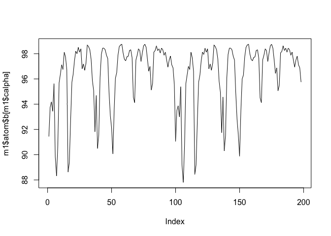
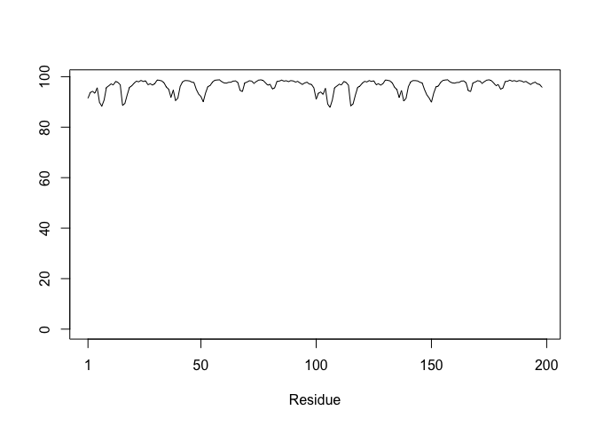

# Lab 11 Structural Bioinformatics pt2
Blinda Sui (PID: A17117043)

## AlphaFold Data Base (AFDB)

The EBI maintains the larest database of AlphaFold structure prediction
models at: http://alphafold.ebi.ac.uk

From last class (before Halloween) we saw that the PDB had 244,290 (Oct
2025)

The total number of protein sequences in UniProtKB is 199,579,901

> Key Point: This is a tiny fraction of sequence space that has
> structural coverage (0.12%)

``` r
244290/199579901 * 100
```

    [1] 0.1224021

AFDB is attempting to address this gap…

There are two “Quality Scores” from AlphaFold one for residues
(i.e. each amino acid) called **pLDDT** score. The other **PAE** score
that measures the confidence in the relative position of two residues
(i.e. a score for every pair of residues).

## Generating your own structure predictions

Figure of 5 generated HIP-PR models


and the top ranked model colored by chain


pLDDT score for model 1


and model 5


# Custom analysis of resulting models in R

Read key result files into R. The first thing I need to know is what my
results direcvtory/folder is called (i.e. it name is different for every
AlphaFold run/job)

``` r
results_dir <- "HIPPR_dimer_23119/"

# File names for all PDB models
pdb_files <- list.files(path=results_dir,
                        pattern="*.pdb",
                        full.names = TRUE)

# Print our PDB file names
basename(pdb_files)
```

    [1] "HIPPR_dimer_23119_unrelaxed_rank_001_alphafold2_multimer_v3_model_4_seed_000.pdb"
    [2] "HIPPR_dimer_23119_unrelaxed_rank_002_alphafold2_multimer_v3_model_1_seed_000.pdb"
    [3] "HIPPR_dimer_23119_unrelaxed_rank_003_alphafold2_multimer_v3_model_5_seed_000.pdb"
    [4] "HIPPR_dimer_23119_unrelaxed_rank_004_alphafold2_multimer_v3_model_2_seed_000.pdb"
    [5] "HIPPR_dimer_23119_unrelaxed_rank_005_alphafold2_multimer_v3_model_3_seed_000.pdb"

``` r
library(bio3d)

m1 <- read.pdb(pdb_files[1])
m1
```


     Call:  read.pdb(file = pdb_files[1])

       Total Models#: 1
         Total Atoms#: 1514,  XYZs#: 4542  Chains#: 2  (values: A B)

         Protein Atoms#: 1514  (residues/Calpha atoms#: 198)
         Nucleic acid Atoms#: 0  (residues/phosphate atoms#: 0)

         Non-protein/nucleic Atoms#: 0  (residues: 0)
         Non-protein/nucleic resid values: [ none ]

       Protein sequence:
          PQITLWQRPLVTIKIGGQLKEALLDTGADDTVLEEMSLPGRWKPKMIGGIGGFIKVRQYD
          QILIEICGHKAIGTVLVGPTPVNIIGRNLLTQIGCTLNFPQITLWQRPLVTIKIGGQLKE
          ALLDTGADDTVLEEMSLPGRWKPKMIGGIGGFIKVRQYDQILIEICGHKAIGTVLVGPTP
          VNIIGRNLLTQIGCTLNF

    + attr: atom, xyz, calpha, call

``` r
plot(m1$atom$b[m1$calpha], typ="l")
```



``` r
plot.bio3d(m1$atom$b[m1$calpha], typ="l")
```



## Residue conservation from alignment file

Find the large AlphaFold alignment file

``` r
aln_file <- list.files(path=results_dir,
                       pattern=".a3m$",
                        full.names = TRUE)
aln_file
```

    [1] "HIPPR_dimer_23119//HIPPR_dimer_23119.a3m"

Read this into R

``` r
aln <- read.fasta(aln_file[1], to.upper = TRUE)
```

    [1] " ** Duplicated sequence id's: 101 **"
    [2] " ** Duplicated sequence id's: 101 **"

How many sequences are in this alignment

``` r
dim(aln$ali)
```

    [1] 5397  132

We can score residue conservation in the alignment with the conserv()
function.

``` r
sim <- conserv(aln)
```

``` r
plotb3(sim[1:99], ylab="Conservation Score")
```


``` r
con <- consensus(aln, cutoff = 0.9)
con$seq
```

      [1] "-" "-" "-" "-" "-" "-" "-" "-" "-" "-" "-" "-" "-" "-" "-" "-" "-" "-"
     [19] "-" "-" "-" "-" "-" "-" "D" "T" "G" "A" "-" "-" "-" "-" "-" "-" "-" "-"
     [37] "-" "-" "-" "-" "-" "-" "-" "-" "-" "-" "-" "-" "-" "-" "-" "-" "-" "-"
     [55] "-" "-" "-" "-" "-" "-" "-" "-" "-" "-" "-" "-" "-" "-" "-" "-" "-" "-"
     [73] "-" "-" "-" "-" "-" "-" "-" "-" "-" "-" "-" "-" "-" "-" "-" "-" "-" "-"
     [91] "-" "-" "-" "-" "-" "-" "-" "-" "-" "-" "-" "-" "-" "-" "-" "-" "-" "-"
    [109] "-" "-" "-" "-" "-" "-" "-" "-" "-" "-" "-" "-" "-" "-" "-" "-" "-" "-"
    [127] "-" "-" "-" "-" "-" "-"
